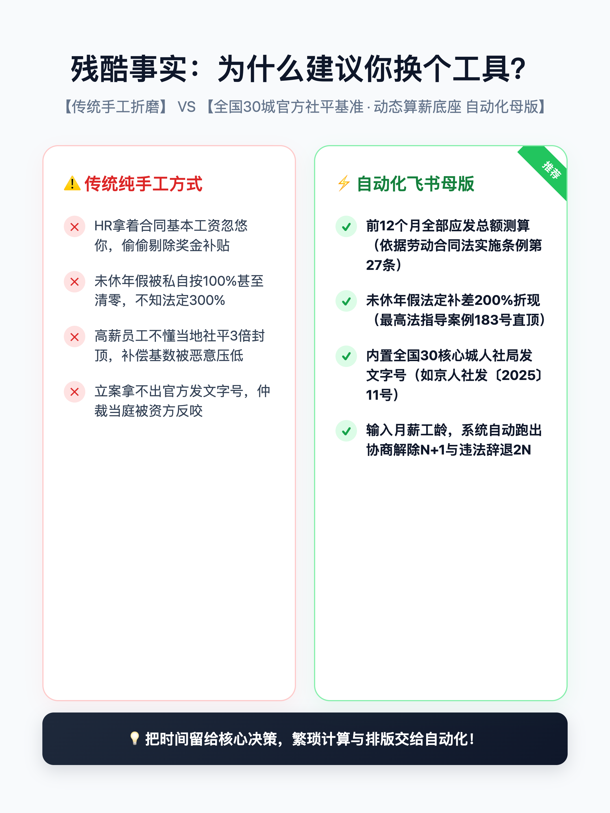

# 🛡️ 劳动者离职补偿精算底座与被裁自救指南 (2026最新版)

> **核心信条**：裁员是严肃的法理与数据博弈，绝不是资方的单方施舍。  
> 本项目由**极客小木数字实验室**发起，旨在打造全网中立、透明、客观的劳动法离职补偿精算底座与维权武器库。

[](severance_calc.py)
[](LICENSE)
[](data/national_30_cities_2026.json)
[](data/national_30_cities_2026.csv)
[](CONTRIBUTING.md)

---

## ⚡ 极速体验通道 (两分钟快速自测)

### 方式一：💻 纯 Python 零依赖极客命令行精算器 (CLI)
本项目内置零第三方依赖的离职补偿精算脚本，直接使用 Python 标准库运行：

```bash
# 克隆仓库
git clone https://github.com/jikexm/layoff-severance-guide.git
cd layoff-severance-guide

# 一行命令极速测算 (以杭州、月薪3.5万、司龄3.2年、年终奖6万、未休年假5天为例)
python severance_calc.py --city 杭州 --salary 35000 --years 3.2 --annual-bonus 60000 --unused-leave 5

# 或者直接回车进入交互式问答模式
python severance_calc.py
```

### 方式二：📱 在线免登录飞书多维工作台 (Live Demo)
- 🔗 **[点击直接打开工作台只读演示版]**：[👉 飞书云端多维工作台演示版](https://feishu.cn/base/ZeSSb4ioAae1EXsyyBXcnaPvnDf)  
  *(无需安装任何环境，PC/手机浏览器即开即测，直观体验全国 30 城基准联动与自动化测算效果)*

---

## 📸 实战工作台全景预览

| 30城社平联动与多维精算作战室 | 24类仲裁立案证据链看板与公文生成 |
| :---: | :---: |
|  |  |

---

## 🧭 核心文档与数据资产导航

| 序号 | 模块文档 / 数据资产 | 核心内容概要 |
| :---: | :--- | :--- |
| **00** | [💻 severance_calc.py](severance_calc.py) | **零依赖终端离职补偿精算器**：内置30城基准、300%年假与个税免征测算 |
| **01** | [📊 全国30核心城市2026社平工资与封顶基准表](01_全国30核心城市2026社平工资与封顶基准表.md) | 30城全量人社局官方社平工资、3倍封顶线及公报溯源（附 [JSON](national_30_cities_2026.json) / [CSV](national_30_cities_2026.csv) 开放数据） |
| **02** | [📐 离职经济补偿金(N/N+1/2N)法定精算指南](02_离职经济补偿金(N_N加1_2N)法定精算指南.md) | 《劳动合同法》第46/47/87条推导、全口径月薪折算、**财税〔2018〕164号个税免征红线** |
| **03** | [🛑 被裁员进小黑屋谈判30秒急救清单](03_被裁员进小黑屋谈判30秒急救清单.md) | 随身防身小抄：绝不签署清单、合法录音留痕、反问HR标准公文口径 |
| **04** | [⚖️ 大厂裁员逼退十一大伪常识与司法裁判真相](04_大厂裁员逼退十大伪常识与司法裁判真相.md) | **融入2025年9月1日《最高法劳动争议解释二》(法释〔2025〕12号)**，拆穿协议免责、期权剥夺、末位淘汰 |
| **05** | [📝 劳动人事争议仲裁申请书标准公文范本](05_劳动人事争议仲裁申请书_标准公文范本.md) | 符合仲裁委立案标准的 Markdown 填空式文书模板 |
| **06** | [💡 为什么需要全流程飞书工作台](06_为什么需要全流程飞书工作台.md) | 开源静态文档 vs 飞书实战作战室（24类证据链+手机即用看板）能力矩阵对比 |

---

## 📊 一线核心城市 2026 社平基准与免税额度速览 (节选)

> 📌 **完整数据开放下载**：
> - 📄 JSON 格式：[`national_30_cities_2026.json`](national_30_cities_2026.json)
> - 📑 CSV 格式：[`national_30_cities_2026.csv`](national_30_cities_2026.csv)

| 城市 | 职工月平均工资 | 3倍社平封顶基数 (月补偿上限) | 财税〔2018〕164号 免个税红线 (年3倍) | 适用年限封顶限制 |
| :--- | :--- | :--- | :--- | :--- |
| **北京** | 11,200 元/月 | **33,600** 元/月 | **¥403,200** 元以内全额免征 | 高于3倍社平者最长12年；低于者无限制 |
| **上海** | 12,183 元/月 | **36,549** 元/月 | **¥438,588** 元以内全额免征 | 高于3倍社平者最长12年；低于者无限制 |
| **深圳** | 12,964 元/月 | **38,892** 元/月 | **¥466,704** 元以内全额免征 | 高于3倍社平者最长12年；低于者无限制 |
| **广州** | 10,850 元/月 | **32,550** 元/月 | **¥390,600** 元以内全额免征 | 高于3倍社平者最长12年；低于者无限制 |
| **杭州** | 10,250 元/月 | **30,750** 元/月 | **¥369,000** 元以内全额免征 | 高于3倍社平者最长12年；低于者无限制 |

---

## 📐 核心法理与精算公式大白话速查

1. **法定经济补偿金 (N)**：
   $$\text{补偿金} = \text{解除前12个月全口径应发平均月薪} \times \text{折算司龄年限}$$
   *注：依据《劳动合同法实施条例》第27条，月薪必须包含底薪、绩效、年终奖月均摊入、加班费及津贴！*
2. **代通知金 (+1)**：
   未提前 30 天书面通知解除的，额外支付 1 个月上月全额应发工资。
3. **违法解除赔偿金 (2N)**：
   资方单方无合法法定事由（如以末位淘汰、拒签PIP逼退）违法解除劳动合同，按经济补偿标准的 2 倍支付。
4. **未休年假报酬 (300%)**：
   当年应休未休年假天数，按日工资收入的 300% 支付（除正常已发工资外，离职交接时额外补发 200% 差额）。
5. **离职补偿金个税免征红线 (财税〔2018〕164号)**：
   个人领取的离职补偿收入，在当地上年度职工平均工资 3 倍以内的部分，**100% 免征个人所得税**！

---

## ⚖️ 能力矩阵全景对比：开源文档 vs 飞书全流程工作台

| 对比维度 | GitHub 开源文档库 | 飞书全流程多维工作台 (Pro) |
| :--- | :--- | :--- |
| **内容形态** | 静态 Markdown 文字指南 | 交互式动态云端数据库 |
| **社平数据** | 30城表格静态查阅 | **动态自动化关联匹配与计算** |
| **使用场景** | 电脑端长文研读 | **手机端即开即测、会议室小黑屋随身防身** |
| **复杂非标折算** | 手动查阅法条自己算 | **医疗期顺延、跨期年终奖摊薄一键自动折算** |
| **证据链管理** | 文字提示“请注意保留证据” | **24类仲裁证据固定结构化数据库 (支持手机拍照存证)** |
| **文书生成** | Markdown 纯文本填空 | **动态变量注入，一键导出打印级排版公文 (EMS异议函/申请书)** |
| **数据隐私** | 纯本地查看 | **私有化独立母版复制，数据仅保存在个人飞书账号，端到端加密** |
| **更新机制** | 需关注 Git Commit | **云端知识库每周动态热更新推送** |

---

## 📲 进阶：如何获取可私有化编辑的独立母版？

开源文档与在线演示版仅供参考查阅。如果你正在面临约谈，需要**将个人薪资与考勤私密保存在自己的独立空间、解锁 24 类仲裁立案证据链看板，并一键导出标准格式《异议函》《仲裁申请书》**：

<div align="center">
  
</div>

1. 打开微信，扫描上方二维码（或搜索关注公众号：**【极客小木】**）；
2. 在后台回复关键词：**【工作台】**；
3. 即可获取专属独立母版复制通道及 2026 云端持续更新权益。

---

## 🔒 免责声明

本项目所收录的法规条文、地方公报基准及测算逻辑均来源于公开司法裁量指引与人社统计公报，旨在为劳动者提供法理常识普及与自测参考，不构成个案具体的法律代理意见。如遇复杂案情，建议咨询专业劳动维权律师。

## 📄 开源许可证

本项目基于 [MIT License](LICENSE) 开源发布。
